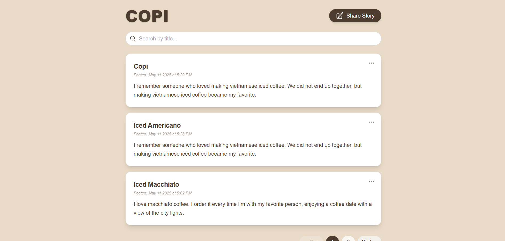
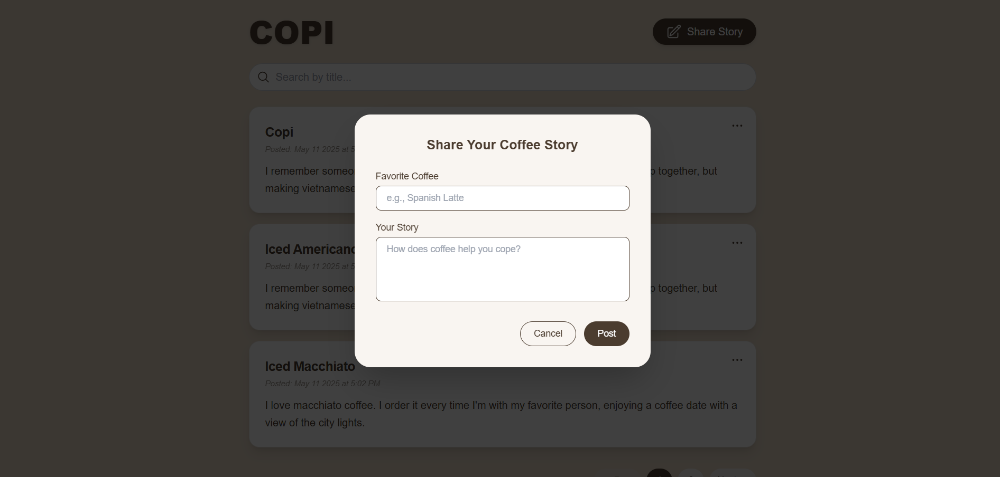
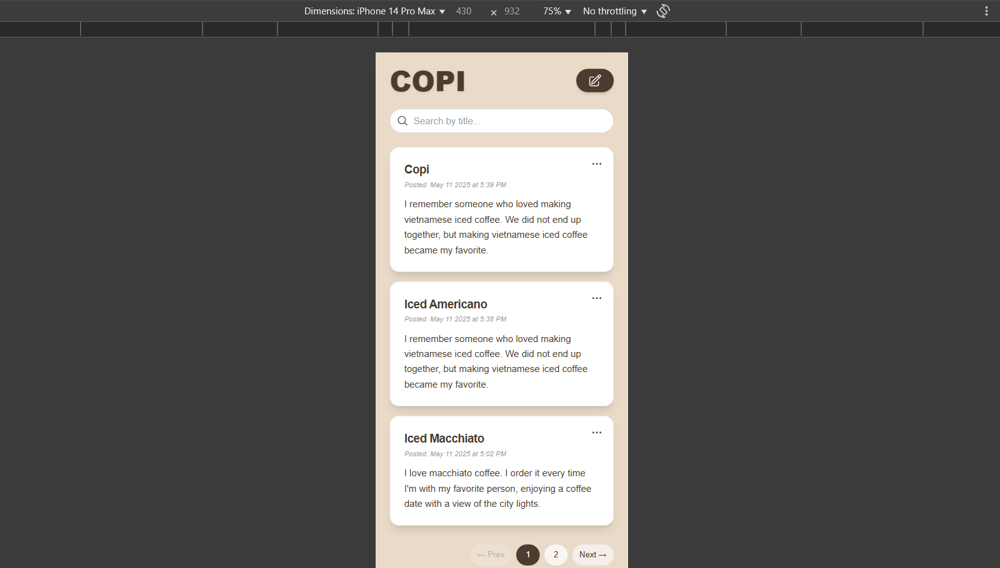
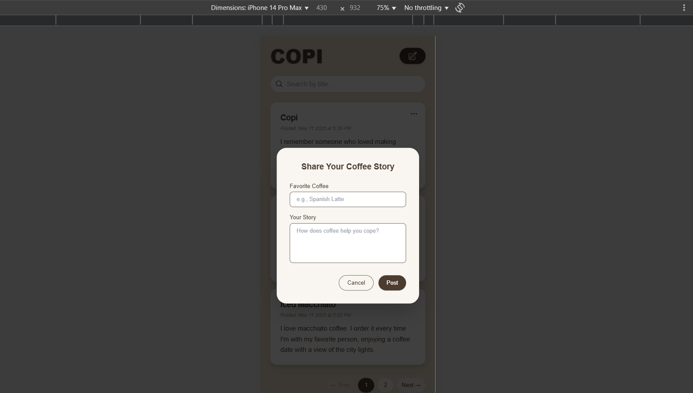

# ☕ COPI - Coffee Story Sharing App

COPI is a minimalist blogsite app where users can post, edit, and delete their coffee-related stories. The interface is clean and inspired by cozy café vibes. It supports pagination, modals for creating/editing, and expandable post previews.

---

## Features

- Responsive and stylish UI (Tailwind CSS)
- Create, Edit, and Delete coffee stories
- Search stories by title
- Expandable post previews (with “More”/”Less” toggle)
- Modal form for input and edit
- Pagination (3 posts per page)
- Connects to a backend via REST API using Axios

---

## Tech Stack

- Typescript
- Next.js
- Tailwind CSS
- Axios to Fetch API
- REST API backend

---

## Project Structure Overview

### Main Layout

- Uses `flex`, `bg`, and `min-h-screen` for full-page layout
- Centered content in a warm coffee-inspired theme
- Heroicons used for icons

### Header

- Big app title `COPI`
- `Share Story` button opens modal

### Search

- User can search stories by title

### Story Cards Components

- Fetched stories are displayed as cards
- Each card includes:
  - Title
  - Created or updated date
  - Truncated content (200 chars max) with **More/Less** toggle
  - Dropdown menu (Edit/Delete)

### Modal (Create/Edit) Components

- Form with inputs:
  - Title (`Favorite Coffee`)
  - Story content (`Your Story`)
- Appears when:
  - Clicking `Share Story`
  - Clicking `Edit` on a post

### Pagination

- 3 posts per page
- Navigation: Prev, Page Numbers, Next

---

## Implement the CRUD

- **fetchPosts** - This function is called inside a `useEffect` hook when the component is mounted. It sends a GET request to the `/posts` endpoint of the backend API to retrieve stories. The results are stored in the posts state. `fetchPosts` now supports the following optional parameters for filtering and pagination:
- `search?`: string – Filters posts based on a keyword in the title.
- `limit?`: number – Limits the number of posts returned per request (default: 3).
- `offset?`: number – Skips a number of posts (used for pagination).

- **handleSubmit** - This function handles both `creating` a new post and `updating` an existing one, depending on whether isEdit is true or false. It sends a `POST` or `PATCH` request to the backend API with the form data.

- **deletePost** - This function deletes a post by sending a `DELETE` request to /posts/:id on the backend.

---

## Backend API must respond to:

- GET /posts
- POST /posts
- PATCH /posts/:id
- DELETE /posts/:id

---

## Axios Configuration

This is to handle HTTP requests to the Flask backend efficiently.

- **Base URL**: Controlled via the `NEXT_PUBLIC_API_URL` environment variable for flexibility between environments
- **Default Headers**: Sets `Content-Type`: `application/json` to ensure all requests send and receive JSON data.

---

## How to Run

To run the app locally, simply execute the following command using bash:

**1.** Clone the repository

- git clone <repository-url>
- cd <project-folder>

**2.** Install dependencies

- npm install

**3.** Configure environment variables

- Create a `.env.local` file in the root and add your backend URL:
- **.env URL format example**: NEXT_PUBLIC_API_URL=http://localhost:5000

**4.** Run the web app

- npm run dev

---

## UI Design

- Desktop View
  
  

- Mobile View
  
  
